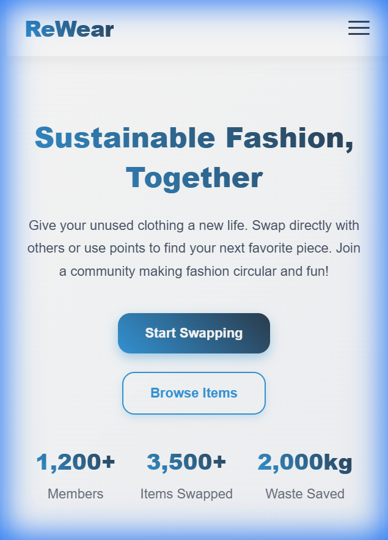
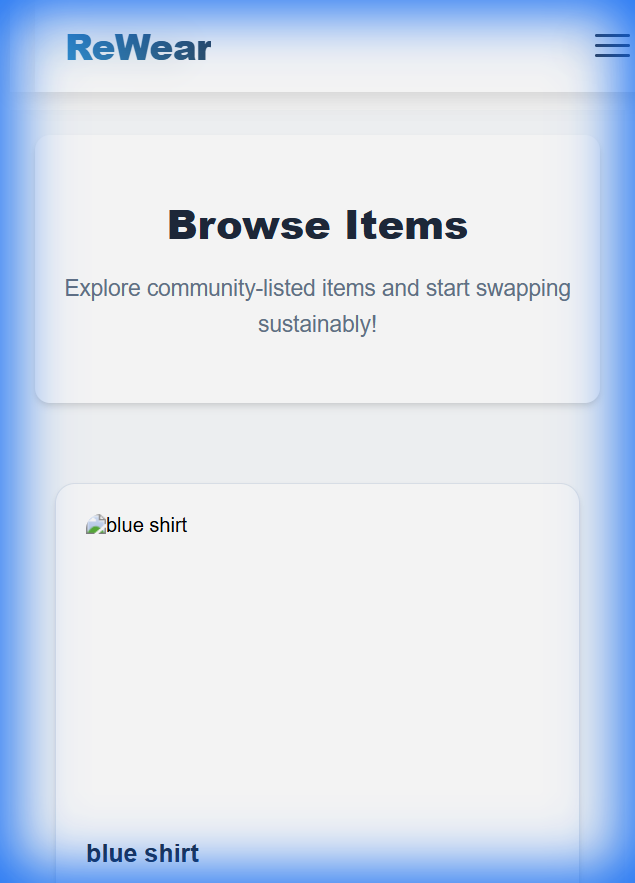
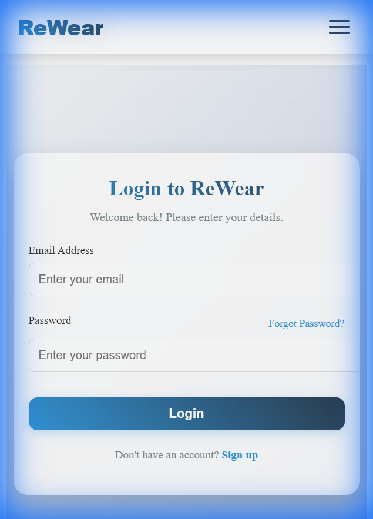
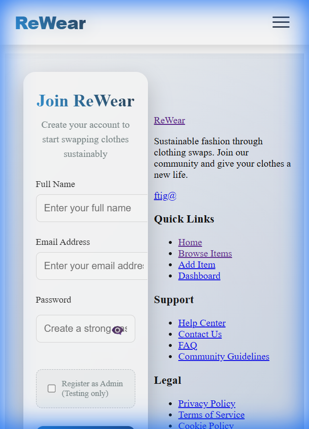
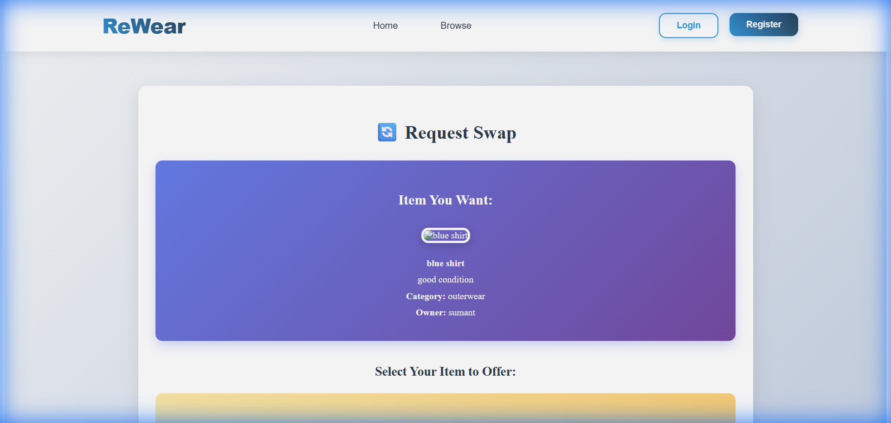

# ReWear: Reimagining Fashion with Tech 🌿👗

> **A Style Using Technology.**
> Join the circular fashion revolution. Swap, share, and sustain.



## 📖 Overview

**ReWear** is a sustainable fashion platform designed to reduce textile waste by facilitating peer-to-peer clothing swaps. Built with modern technology, it offers a seamless and aesthetic experience for users to give their unused clothes a new life and find unique pieces without the environmental cost of fast fashion.

## ✨ Key Features

-   **♻️ Sustainable Swapping**: Easily list items you no longer need and request swaps for items you love.
-   **🎨 Aesthetic Interface**: A clean, modern, and user-friendly design focused on visual clarity.
-   **🔐 Secure Authentication**: Robust user registration and login system.
-   **⚡ Real-Time Updates**: Instant visibility of added items (Auto-approved).
-   **📱 Responsive Design**: Fully optimized for desktop and mobile devices.

## 🚀 Tech Stack

-   **Frontend**: React.js, CSS3 (Custom Styling)
-   **Backend**: Node.js, Express.js
-   **Database**: MongoDB
-   **Image Storage**: AWS S3 / Local Storage (Multer)

## 📸 Gallery

### Browse Collection
Explore a curated list of community-driven items.


### Secure Login & Registration
Safe and simple entry to the platform.
<div style="display: flex; gap: 10px;">
  
  
</div>

### Seamless Swap Requests
Request swaps with a single click, viewing full item details.


## 🛠️ Installation & Setup

1.  **Clone the repository**
    ```bash
    git clone https://github.com/OM1246/ReWear-Reimagining-Fashion-with-Tech.git
    cd ReWear-Reimagining-Fashion-with-Tech
    ```

2.  **Install Dependencies**
    ```bash
    # Backend
    cd rewear-backend
    npm install

    # Frontend
    cd ../rewear-frontend
    npm install
    ```

3.  **Run the Application**
    ```bash
    # Backend (Terminal 1)
    cd rewear-backend
    npm run dev

    # Frontend (Terminal 2)
    cd rewear-frontend
    npm start
    ```

## 🤝 Contributing

Contributions are welcome! Please feel free to submit a Pull Request.

---
*Built with ❤️ for a greener planet.*
